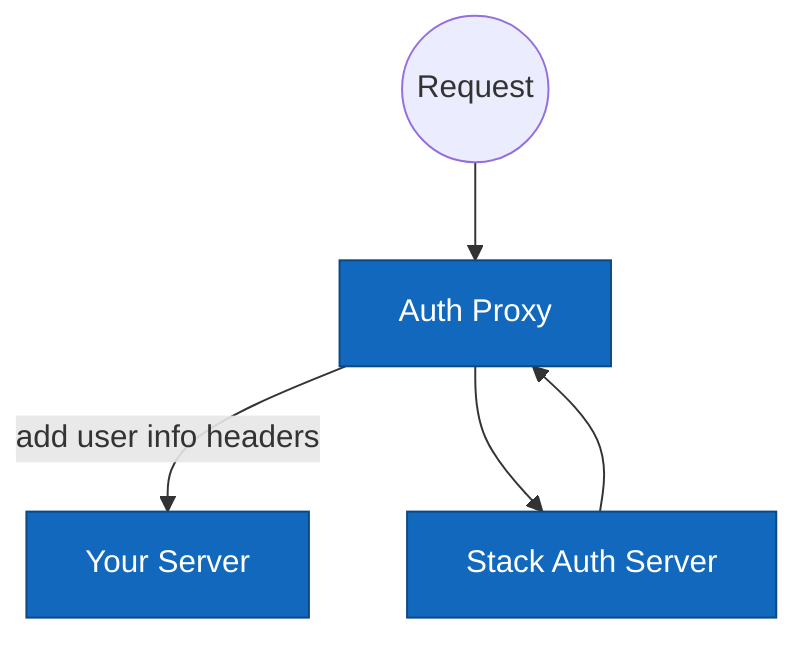

# auth-proxy

auth-proxy is a simple one-command proxy that authenticates your HTTP requests and redirects to a pre-built sign-in page if a user is not authenticated.

## Setup

First, [set up Stack Auth](https://docs.stack-auth.com/getting-started/setup) (either locally or in the cloud), and copy-paste your API keys. Stack Auth is the open-source Auth0 alternative.

Then, start your application server on port `3000` and run the proxy with the following command:

```sh
docker run \
  -e NEXT_PUBLIC_STACK_PROJECT_ID=<project-id> \
  -e NEXT_PUBLIC_STACK_PUBLISHABLE_CLIENT_KEY=<client-key> \
  -e STACK_SECRET_SERVER_KEY=<server-key> \
  -e SERVER_PORT=3000 \
  -e PROXY_PORT=3001 \
  -p 3001:3001 \
  stackauth/auth-proxy:latest <patterns>
```

You can now access your application server at [localhost:3001](http://localhost:3001) and all the routes under the protected patterns will only be accessible by authenticated users.

The protected patterns are URL patterns (check out the syntax [here](https://github.com/snd/url-pattern)). Don't forget to include the leading `/` and handling the trailing `/`.

For example, if you want to protect everything under `/a` and only the route `/b` (not `/b/c`), you can run 

`... stackauth/auth-proxy:latest "/a(/*)" "/b(/)"`.

<details>
  <summary>If you don't have an application server, you can run our example server to play around with the proxy</summary>

Start the example server on port 3000:
```sh
git clone git@github.com:stack-auth/auth-proxy.git
cd express-example-server
npm install
npm run dev
```

You can check out the original server without the proxy at [localhost:3000](http://localhost:3000).

Now, open a new terminal and run the proxy server on port 3000:

```sh
docker run \
  -e NEXT_PUBLIC_STACK_PROJECT_ID=<project-id> \
  -e NEXT_PUBLIC_STACK_PUBLISHABLE_CLIENT_KEY=<client-key> \
  -e STACK_SECRET_SERVER_KEY=<server-key> \
  -e SERVER_PORT=3000 \
  -e PROXY_PORT=3001 \
  -p 3001:3001 \
  stackauth/auth-proxy:latest "/protected(/*)"
```

You can explore the proxy at [localhost:3001](http://localhost:3001).
</details>

## What You Get

If you access a protected page through the proxy without being authenticated, you will be redirected to a sign-in page like this (customizable on the dashboard):

<div align="center">

</div>

After signing in, you will be able to access the protected pages. 

To retrieve user information from your webpage, you can read the headers as shown in this JavaScript Express + handlebars example (works similarly on other languages/frameworks):

```js
const express = require("express");
const handlebars = require("handlebars");

const app = express();

const template = handlebars.compile(`
<div>
  {{#if authenticated}}
    <p>Name: {{displayName}}</p>
    <p><a href="/handler/account-settings">Account Settings</a></p>
  {{else}}
    <p><a href="/handler/sign-in">Sign In</a></p>
  {{/if}}
</div>
`);

app.get('/', (req, res) => {
  const authenticated = !!req.headers['x-stack-authenticated'];
  const displayName = req.headers['x-stack-user-display-name'] || '';
  const html = template({ authenticated, displayName });
  res.send(html);
});

app.listen(3000);
```

Available headers:

- `x-stack-authenticated`: "true" if authenticated; not present otherwise.
- `x-stack-user-id`
- `x-stack-user-primary-email`
- `x-stack-user-display-name`

Available URLs (redirect your app server to these URLs as needed):

- `/handler/sign-in`
- `/handler/sign-up`
- `/handler/sign-out`: Clears cookies and redirects back to your homepage.
- `/handler/account-settings`: Users can update their email, display name, password, etc.
- `/handler/me`: If you make a request to this URL with the user's session cookie, you get a more detailed user object. This is useful for client-side apps.

## How It Works

When a request is received, the logic is as follows:

```
if url is /handler/*:
  render the auth pages
else:
  if user is not authenticated && url is protected:
    redirect to /handler/sign-in
  else:
    forward the request to your server with user info headers
```



This diagram illustrates the request flow and interactions between the client, the proxy, your server, and the Stack Auth server.
